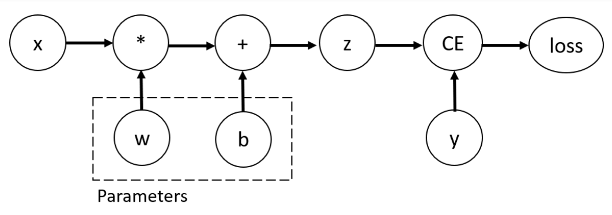

## 1、tensor
https://docs.pytorch.org/tutorials/beginner/basics/tensorqs_tutorial.html

## 2、Quickstart
torch.utils.data.Dataset:stores the samples and their corresponding labels  

torch.utils.data.DataLoader:wraps an iterable around the Dataset

full datasets list:  
https://docs.pytorch.org/vision/stable/datasets.html

## 3、Datasets
https://docs.pytorch.org/tutorials/beginner/basics/data_tutorial.html  

构建自己的dataset  

    import os
    import pandas as pd
    from torchvision.io import decode_image

    class CustomImageDataset(Dataset):
        def __init__(self, annotations_file, img_dir, transform=None, target_transform=None):
            self.img_labels = pd.read_csv(annotations_file)
            self.img_dir = img_dir
            self.transform = transform
            self.target_transform = target_transform

        def __len__(self):
            return len(self.img_labels)

        def __getitem__(self, idx):
            img_path = os.path.join(self.img_dir, self.img_labels.iloc[idx, 0])
            image = decode_image(img_path)
            label = self.img_labels.iloc[idx, 1]
            if self.transform:
                image = self.transform(image)
            if self.target_transform:
                label = self.target_transform(label)
            return image, label
其中，
__init__ 函数在实例化 Dataset 对象时运行一次。我们会对包含图像的目录、标注文件以及两种transform（下一节将详细介绍）进行初始化。   

The __init__ function is run once when instantiating the Dataset object. We initialize the directory containing the images, the annotations file, and both transforms (covered in more detail in the next section).  

__len__ 函数返回我们数据集中的样本数量。  

__getitem__ 函数会加载并返回数据集中给定索引 `idx` 处的一个样本。它根据该索引确定image在磁盘上的位置，使用 `decode_image` 将其转换为张量，从 `self.img_labels` 的 csv 数据中获取对应的标签，对它们调用变换函数（如果适用），并以元组的形式返回张量图像和对应的标签。  

The __getitem__ function loads and returns a sample from the dataset at the given index idx. Based on the index, it identifies the image’s location on disk, converts that to a tensor using decode_image, retrieves the corresponding label from the csv data in self.img_labels, calls the transform functions on them (if applicable), and returns the tensor image and corresponding label in a tuple.  

---
We have loaded that dataset into the DataLoader and can iterate through the dataset as needed. Each iteration below returns a batch of train_features and train_labels (containing batch_size=64 features and labels respectively). Because we specified shuffle=True, after we iterate over all batches the data is shuffled (for finer-grained control over the data loading order, take a look at Samplers). 

Datasets可以一次提取一个样本的特征和标签。在实际训练模型时，需要以“小批量”的形式传递样本，在每个 epoch（轮次）重新打乱数据以减少模型过拟合，并使用 Python 的multiprocessing来加快数据提取速度。简而言之：datasets仅支持单条查数，难以支持批量数据及同步的数据处理。

## 4、transform
https://docs.pytorch.org/tutorials/beginner/basics/transforms_tutorial.html  

Data does not always come in its final processed form that is required for training machine learning algorithms. We use transforms to perform some manipulation of the data and make it suitable for training.

数据并不总是以训练机器学习算法所需的最终处理形式存在。我们使用变换对数据进行一些处理，使其适合训练。

All TorchVision datasets have two parameters -transform to modify the features and target_transform to modify the labels - that accept callables containing the transformation logic. The torchvision.transforms module offers several commonly-used transforms out of the box.

所有 TorchVision 数据集都有两个参数——`transform` 用于修改特征，`target_transform` 用于修改标签——这两个参数接收包含变换逻辑的可调用对象。`torchvision.transforms` 模块提供了几个常用的现成变换。

The FashionMNIST features are in PIL Image format, and the labels are integers. For training, we need the features as normalized tensors, and the labels as one-hot encoded tensors. To make these transformations, we use ToTensor and Lambda.

FashionMNIST的特征以PIL图像格式呈现，标签则是整数。在训练时，我们需要将特征转换为归一化的张量，将标签转换为独热编码的张量。为了实现这些转换，我们会使用ToTensor和Lambda。

    import torch
    from torchvision import datasets
    from torchvision.transforms import ToTensor, Lambda

    ds = datasets.FashionMNIST(
        root="data",
        train=True,
        download=True,
        transform=ToTensor(),
        target_transform=Lambda(lambda y: torch.zeros(10, dtype=torch.float).scatter_(0, torch.tensor(y), value=1))
    )

Lambda Transforms  
Lambda transforms apply any user-defined lambda function. Here, we define a function to turn the integer into a one-hot encoded tensor. It first creates a zero tensor of size 10 (the number of labels in our dataset) and calls scatter_ which assigns a value=1 on the index as given by the label y.

Lambda 变换可应用任何用户定义的 lambda 函数。在这里，我们定义了一个函数，用于将整数转换为独热编码的张量。该函数首先创建一个大小为 10（我们数据集中的标签数量）的零张量，然后调用 scatter_ 方法，在由标签 y 给定的索引位置赋值 1。

具体有多少transform，后续实践的时候再看。

## 5、Build the Neural Network
https://docs.pytorch.org/tutorials/beginner/basics/buildmodel_tutorial.html

### Define the Class

We define our neural network by subclassing nn.Module, and initialize the neural network layers in \_\_init__. Every nn.Module subclass implements the operations on input data in the forward method

使用nn.Module定义一个神经网络，在__init__函数中初始化网络层。每个 nn.Module subclass 在forward方法中实现输入数据的操作


    class NeuralNetwork(nn.Module):
        def __init__(self):
            super().__init__()
            self.flatten = nn.Flatten()
            self.linear_relu_stack = nn.Sequential(
                nn.Linear(28*28, 512),
                nn.ReLU(),
                nn.Linear(512, 512),
                nn.ReLU(),
                nn.Linear(512, 10),
            )

    def forward(self, x):
            x = self.flatten(x)
            logits = self.linear_relu_stack(x)
            return logits

We create an instance of NeuralNetwork, and move it to the device, and print its structure.

    model = NeuralNetwork().to(device)
    print(model)

to use the model, we pass it the input data. This executes the model’s forward, along with some background operations. Do not call model.forward() directly!

使用model(),而不是model.forward()函数的用法

Calling the model on the input returns a 2-dimensional tensor with dim=0 corresponding to each output of 10 raw predicted values for each class, and dim=1 corresponding to the individual values of each output. We get the prediction probabilities by passing it through an instance of the nn.Softmax module.

在输入上调用模型会返回一个二维张量，其中第 0 维对应每个输出（即每个类别的 10 个原始预测值），第 1 维对应每个输出的具体数值。
简单来说，假设输入是一批张图片，模型输出的张量形状可能是 (1, 10)—— 其中第一个维度（dim=0）的大小为 1（表示 1 个样本），第二个维度（dim=1）的大小为 10（对应 10 个类别的原始预测分数，未经过 softmax 归一化）。
如果输入是一个包含 32 张图片的批量数据，输出张量的形状会是 (32, 10)——dim=0 的 32 对应 32 个样本，dim=1 的 10 对应每个样本的 10 个类别预测值。

    X = torch.rand(1, 28, 28, device=device)
    logits = model(X)
    pred_probab = nn.Softmax(dim=1)(logits)
    y_pred = pred_probab.argmax(1)
    print(f"Predicted class: {y_pred}")


### model layers  

#### nn.Flatten

We initialize the nn.Flatten layer to convert each 2D 28x28 image into a contiguous array of 784 pixel values ( the minibatch dimension (at dim=0) is maintained).

我们初始化 `nn.Flatten` 层，用于将每张 2D 28x28 图像转换为一个包含 784 个像素值的连续数组（小批量维度（在 dim=0 处）会被保留）。

简单来说，`nn.Flatten` 的作用是"展平"图像数据：
- 输入是形状为 `(批量大小, 1, 28, 28)` 的张量（假设单通道灰度图）
- 经过 `nn.Flatten` 后，输出变为 `(批量大小, 784)` 的张量（28×28=784）

这样处理后，图像的空间结构被展开为一维向量，便于后续全连接层进行处理。而批量维度（记录样本数量的维度）会被保留，确保小批量中的每个样本都能正确对应到其展平后的特征向量。

#### nn.Linear
The linear layer is a module that applies a linear transformation on the input using its stored weights and biases.

线性层是一个模块，它利用自身存储的权重和偏置对输入执行线性变换。

具体来说，线性层会对输入张量进行如下运算：
输出 = 输入 × 权重 + 偏置

其中，权重（weight）和偏置（bias）是线性层的可学习参数，会在训练过程中不断更新。假设输入的特征维度为 in_features，输出的特征维度为 out_features，那么权重的形状为 (out_features, in_features)，偏置的形状为 (out_features,)。

#### nn.ReLU

Non-linear activations are what create the complex mappings between the model’s inputs and outputs. They are applied after linear transformations to introduce nonlinearity, helping neural networks learn a wide variety of phenomena.

In this model, we use nn.ReLU between our linear layers, but there’s other activations to introduce non-linearity in your model.

非线性激活函数用于在模型的输入和输出之间建立复杂的映射关系。它们在 linear 变换之后应用，以引入非线性特性，帮助神经网络学习各种复杂的模式。

在这个模型中，我们在线性层之间使用了 `nn.ReLU` 激活函数，但还有其他激活函数也可以为模型引入非线性，例如 `nn.Sigmoid`、`nn.Tanh`、`nn.LeakyReLU` 等。这些非线性激活函数是神经网络能够拟合复杂数据分布的关键——如果只有线性变换，无论网络有多少层，整体仍然是线性映射，无法捕捉数据中的非线性关系。

#### nn.Sequential

nn.Sequential is an ordered container of modules. The data is passed through all the modules in the same order as defined. You can use sequential containers to put together a quick network like seq_modules.

nn.Sequential 是一个有序的模块容器。数据会按照模块定义的顺序依次通过所有模块。你可以使用这种顺序容器来快速组合出一个网络，例如 seq_modules 这样的网络结构。

简单来说，nn.Sequential 就像一个 "流水线"，它将多个神经网络层按顺序打包：

输入数据会先经过第一个模块处理
处理结果自动传入第二个模块
以此类推，直到通过最后一个模块并输出结果

#### nn.Softmax

The last linear layer of the neural network returns logits - raw values in [-infty, infty] - which are passed to the nn.Softmax module. The logits are scaled to values [0, 1] representing the model’s predicted probabilities for each class. dim parameter indicates the dimension along which the values must sum to 1.

神经网络的最后一个线性层会返回 logits（即取值范围在 [-∞, ∞] 之间的原始值），这些值会被传入 `nn.Softmax` 模块。经过处理后，logits 会被缩放至 [0, 1] 区间内，代表模型对每个类别的预测概率。`dim` 参数指定了沿哪个维度进行归一化，使得该维度上的所有值之和为 1。

例如，对于形状为 `(批量大小, 10)` 的输出（10 个类别），设置 `dim=1` 意味着对每个样本（批量中的每个元素）的 10 个预测值进行归一化，确保每个样本对应的 10 个概率值之和为 1，从而符合概率分布的特性。

### Model Parameters

Many layers inside a neural network are parameterized, i.e. have associated weights and biases that are optimized during training. Subclassing nn.Module automatically tracks all fields defined inside your model object, and makes all parameters accessible using your model’s parameters() or named_parameters() methods.

神经网络中的许多层都是可参数化的，也就是说，它们具有相关的权重和偏置，这些参数会在训练过程中被优化。通过继承 `nn.Module`，可以自动跟踪模型对象内部定义的所有字段，并使所有参数可通过模型的 `parameters()` 或 `named_parameters()` 方法访问。

这一特性非常实用，例如：
- 调用 `model.parameters()` 可以获取模型中所有可学习的参数（权重和偏置），方便传入优化器进行更新
- 使用 `named_parameters()` 可以同时获取参数的名称和对应的张量，便于调试或针对性地调整某些层的参数

这种自动参数跟踪机制简化了神经网络的实现流程，让开发者无需手动管理参数列表，专注于模型结构设计即可。

    print(f"Model structure: {model}\n\n")

    for name, param in model.named_parameters():
        print(f"Layer: {name} | Size: {param.size()} | Values : {param[:2]} \n")

## 6、Automatic Differentiation with torch.autograd
When training neural networks, the most frequently used algorithm is __back propagation__. In this algorithm, parameters (model weights) are adjusted according to the gradient of the loss function with respect to the given parameter.

在训练神经网络时，最常用的算法是反向传播。在该算法中，参数（模型权重）会根据损失函数相对于给定参数的梯度进行调整。

To compute those gradients, PyTorch has a built-in differentiation engine called . It supports automatic computation of gradient for any computational graph.torch.autograd

为了计算这些梯度，PyTorch 内置了一个名为 torch.autograd 的微分引擎。它支持为任何计算图自动计算梯度。

Consider the simplest one-layer neural network, with input , parameters and , and some loss function. It can be defined in PyTorch in the following manner:x w b

考虑一个最简单的单层神经网络，包含输入 x、参数 w 和 b，以及某个损失函数

    import torch

    x = torch.ones(5)  # input tensor
    y = torch.zeros(3)  # expected output
    w = torch.randn(5, 3, requires_grad=True)
    b = torch.randn(3, requires_grad=True)
    z = torch.matmul(x, w)+b
    loss = torch.nn.functional.binary_cross_entropy_with_logits(z, y)

在这个例子中：
w 和 b 设置了 requires_grad=True，表示我们需要跟踪它们的计算历史并计算梯度
当调用 loss_fn.backward() 时，PyTorch 会自动计算 loss 相对于所有 requires_grad=True 的参数（w 和 b）的梯度
梯度值会存储在参数的 .grad 属性中，供后续优化器更新参数使用

这就是 PyTorch 自动求导机制的核心，它极大简化了神经网络训练中梯度计算的过程。



！ 注意看图中loss的来源，与上述代码的对比

In this network, and are parameters, which we need to optimize. Thus, we need to be able to compute the gradients of loss function with respect to those variables. In order to do that, we set the property of those tensors.w b requires_grad

在这个网络中，w 和 b 是我们需要优化的参数。因此，我们需要能够计算损失函数相对于这些变量的梯度。为了实现这一点，我们需要设置这些张量的 requires_grad 属性。

### Computing Gradients

To optimize weights of parameters in the neural network, we need to compute the derivatives of our loss function with respect to parameters, namely, we need ** under some fixed values of and . To compute those derivatives, we call , and then retrieve the values from and :xyloss.backward()w.gradb.grad

为了优化神经网络中的参数权重，我们需要计算损失函数相对于参数的导数，即在输入 x 和标签 y 的固定值下，求解损失函数对 w 和 b 的偏导数要计算这些导数，我们可以调用 loss.backward()，然后从 w.grad 和 b.grad 中获取梯度值：

    loss.backward()
    print(w.grad)
    print(b.grad)

### Disabling Gradient Tracking 无需梯度追踪

By default, all tensors with are tracking their computational history and support gradient computation. However, there are some cases when we do not need to do that, for example, when we have trained the model and just want to apply it to some input data, i.e. we only want to do forward computations through the network. We can stop tracking computations by surrounding our computation code with block:requires_grad=Truetorch.no_grad()

默认情况下，所有设置了 requires_grad=True 的张量都会跟踪其计算历史并支持梯度计算。然而，在某些情况下我们并不需要这样做，例如，当我们已经训练好模型，只想将其应用于一些输入数据时（即我们只需要通过网络进行前向计算）。我们可以通过用 torch.no_grad() 块包裹计算代码来停止跟踪计算：

    z = torch.matmul(x, w)+b
    print(z.requires_grad)

    with torch.no_grad():
        z = torch.matmul(x, w)+b
    print(z.requires_grad)

Another way to achieve the same result is to use the method on the tensor:detach()

另一种方式实现同样结果，使用detach()

    z = torch.matmul(x, w)+b
    z_det = z.detach()
    print(z_det.requires_grad)

There are reasons you might want to disable gradient tracking:

To mark some parameters in your neural network as frozen parameters.

To speed up computations when you are only doing forward pass, because computations on tensors that do not track gradients would be more efficient.

有一些原因可能会让你想要禁用梯度跟踪：

一是为了将神经网络中的某些参数标记为冻结参数（即不参与训练更新的参数）。

二是当你只进行前向传播时，可以加快计算速度，因为对不跟踪梯度的张量进行计算会更高效。

在迁移学习中，冻结预训练模型的大部分层就是第一种情况的典型应用 —— 我们只训练新添加的少量层，而保持预训练的基础层参数不变，这时候就需要禁用这些冻结层的梯度跟踪。而在模型推理（如预测阶段）时，使用第二种方式可以显著提升计算效率，同时减少内存占用。

### More on Computational Graphs
Conceptually, autograd keeps a record of data (tensors) and all executed operations (along with the resulting new tensors) in a directed acyclic graph (DAG) consisting of Function objects. In this DAG, leaves are the input tensors, roots are the output tensors. By tracing this graph from roots to leaves, you can automatically compute the gradients using the chain rule.

In a forward pass, autograd does two things simultaneously:

- run the requested operation to compute a resulting tensor

- maintain the operation’s gradient function in the DAG.

The backward pass kicks off when is called on the DAG root. then:.backward()autograd

- computes the gradients from each ,.grad_fn

- accumulates them in the respective tensor’s attribute.grad

- using the chain rule, propagates all the way to the leaf tensors.

从概念上讲，`autograd` 会将数据（张量）和所有执行过的操作（以及由此产生的新张量）记录在一个由 `Function` 对象组成的有向无环图（DAG）中。在这个 DAG 中，叶节点是输入张量，根节点是输出张量。通过从根节点到叶节点追溯这个图，可以利用链式法则自动计算梯度。

在前向传播过程中，`autograd` 同时执行两项操作：
1. 运行请求的操作以计算结果张量
2. 在 DAG 中保留该操作的梯度函数（`grad_fn`）

当在 DAG 的根节点上调用 `.backward()` 时，反向传播就会启动。此时 `autograd` 会：
- 从每个 `grad_fn` 计算梯度
- 将这些梯度累积到相应张量的 `.grad` 属性中
- 利用链式法则，一路将梯度传播到叶节点张量

简单来说，前向传播构建计算图并记录"如何反向计算梯度"，反向传播则沿着图从输出（损失）回溯到输入（参数），通过链式法则逐层计算并累积梯度，最终得到损失函数对每个可学习参数的偏导数，为参数更新提供依据。

### Optional Reading: Tensor Gradients and Jacobian Products--后续学习，没看懂

在许多情况下，我们有一个标量损失函数，需要计算它相对于某些参数的梯度。然而，在一些场景中，输出函数可能是一个任意张量。这种情况下，PyTorch 允许你计算所谓的雅可比矩阵乘积（Jacobian product），而非实际的梯度。

具体来说，如果输出是一个张量（而非标量），直接调用 `.backward()` 会报错，因为 PyTorch 无法直接计算张量对参数的梯度。此时需要传入一个与输出张量形状相同的"梯度权重"张量作为参数，用于计算雅可比矩阵与该权重的乘积。

示例如下：
```python
# 假设输出 y 是一个形状为 (2, 3) 的张量
y = some_operation(x, w, b)

# 创建一个与 y 形状相同的权重张量
v = torch.ones_like(y)

# 计算雅可比矩阵与 v 的乘积
y.backward(v)
```

这里的本质是：当输出为张量时，PyTorch 计算的是损失函数对输出的梯度（即 `v`）与输出对参数的雅可比矩阵的乘积，这在某些高阶优化或复杂损失场景中非常有用。而标量损失的反向传播可以看作是这种情况的特例（此时权重张量为 1）。

## 7、Optimizing Model Parameters【继续】

https://docs.pytorch.org/tutorials/beginner/basics/optimization_tutorial.html

Now that we have a model and data it’s time to train, validate and test our model by optimizing its parameters on our data. Training a model is an iterative process; in each iteration the model makes a guess about the output, calculates the error in its guess (loss), collects the derivatives of the error with respect to its parameters (as we saw in the previous section), and optimizes these parameters using gradient descent. For a more detailed walkthrough of this process, check out this video on backpropagation from 3Blue1Brown.

既然我们已经有了模型和数据，接下来就该通过在数据上优化模型参数来进行模型的训练、验证和测试了。训练模型是一个迭代过程：在每一轮迭代中，模型会对输出做出预测，计算其预测中的误差（损失），收集误差相对于其参数的导数（正如我们在上一节中看到的），并使用梯度下降来优化这些参数。想要更详细地了解这个过程，可以观看 3Blue1Brown 关于反向传播的视频。

简单来说，这个迭代过程通常包括以下步骤：
1. **前向传播**：将输入数据传入模型，得到预测结果
2. **计算损失**：通过损失函数比较预测结果与真实标签的差异
3. **反向传播**：计算损失相对于模型参数的梯度（使用 `autograd`）
4. **参数更新**：根据梯度调整参数（如 `w = w - learning_rate * w.grad`）

重复以上步骤，直到模型在训练数据上的表现达到预期或满足停止条件（如达到最大迭代次数）。之后，还需要在未参与训练的验证集和测试集上评估模型性能，以检验其泛化能力。

### Hyperparameters
Hyperparameters are adjustable parameters that let you control the model optimization process. Different hyperparameter values can impact model training and convergence rates (read more about hyperparameter tuning)

超参数是可调整的参数，用于控制模型的优化过程。不同的超参数值会影响模型的训练效果和收敛速度（关于超参数调优的更多内容可参考相关资料）。

We define the following hyperparameters for training:
- Number of Epochs - the number of times to iterate over the dataset

- Batch Size - the number of data samples propagated through the network before the parameters are updated

- Learning Rate - how much to update models parameters at each batch/epoch. Smaller values yield slow learning speed, while large values may result in unpredictable behavior during training.

常见的超参数包括：

学习率（learning rate）：控制参数更新的步长，过大会可能导致不收敛，过小则训练速度过慢
批量大小（batch size）：每次迭代中用于计算梯度的样本数量
迭代次数（number of epochs）：模型遍历整个训练数据集的次数
隐藏层的数量和每层的神经元数量：决定网络的深度和宽度
正则化系数：控制模型的复杂度，防止过拟合

超参数不是通过训练学到的，而是在训练前设置的。选择合适的超参数通常需要结合领域知识、实验和调优经验，对模型的最终性能至关重要。

### Optimization Loop 优化循环
Once we set our hyperparameters, we can then train and optimize our model with an optimization loop. Each iteration of the optimization loop is called an epoch.

Each epoch consists of two main parts:
- The Train Loop - iterate over the training dataset and try to converge to optimal parameters.

- The Validation/Test Loop - iterate over the test dataset to check if model performance is improving.

Let’s briefly familiarize ourselves with some of the concepts used in the training loop. Jump ahead to see the Full Implementation of the optimization loop.

一旦我们设置好了超参数，就可以通过优化循环来训练和优化模型了。优化循环的每一次迭代都称为一个**轮次（epoch）**。

每个轮次包含两个主要部分：
- **训练循环（Train Loop）**：遍历训练数据集，试图让模型收敛到最优参数。
- **验证/测试循环（Validation/Test Loop）**：遍历测试数据集，检查模型性能是否在提升。

下面简要介绍训练循环中用到的一些概念。你也可以直接跳至末尾查看优化循环的完整实现。


### **训练循环中的核心概念**
1. **模型训练模式（`model.train()`）**  
   调用此方法将模型切换到训练模式。对于包含 dropout、批量归一化（BatchNorm）等层的模型，训练模式会启用随机失活、使用当前批次的统计量更新均值和方差，确保训练过程的随机性和适应性。

2. **梯度清零（`optimizer.zero_grad()`）**  
   由于 PyTorch 会累积梯度（即每次调用 `backward()` 时梯度会叠加），因此在每个批次的反向传播前，需要手动清零参数的梯度，避免上一批次的梯度影响当前计算。

3. **前向传播与损失计算**  
   将输入数据传入模型得到预测结果（`pred = model(X)`），再通过损失函数（如 `nn.CrossEntropyLoss`）计算预测值与真实标签（`y`）的差异（`loss = loss_fn(pred, y)`）。

4. **反向传播（`loss.backward()`）**  
   自动计算损失函数相对于所有可学习参数的梯度，并将梯度存储在参数的 `.grad` 属性中。

5. **参数更新（`optimizer.step()`）**  
   优化器根据计算出的梯度更新模型参数（如 `w = w - 学习率 × w.grad`），推动模型向损失减小的方向优化。


### **验证/测试循环中的核心概念**
1. **模型评估模式（`model.eval()`）**  
   调用此方法将模型切换到评估模式。对于 dropout 层，会关闭随机失活（保留所有神经元）；对于 BatchNorm 层，会使用训练过程中累积的移动均值和方差，而非当前批次的统计量，确保评估结果的稳定性。

2. **禁用梯度跟踪（`torch.no_grad()`）**  
   用该上下文管理器包裹验证过程，可禁用梯度计算和图跟踪，显著减少内存占用并加快计算速度（因为验证阶段不需要更新参数，无需反向传播）。

3. **性能指标计算**  
   除了计算损失，通常还会计算准确率（Accuracy）等指标（如预测类别与真实类别匹配的样本比例），直观反映模型在 unseen 数据上的表现。


### **优化循环完整实现示例（PyTorch）**
```python
def train(dataloader, model, loss_fn, optimizer):
    size = len(dataloader.dataset)
    model.train()  # 启用训练模式
    for batch, (X, y) in enumerate(dataloader):
        # 前向传播
        pred = model(X)
        loss = loss_fn(pred, y)
        
        # 反向传播与参数更新
        optimizer.zero_grad()  # 清零梯度
        loss.backward()        # 计算梯度
        optimizer.step()       # 更新参数
        
        # 打印训练进度
        if batch % 100 == 0:
            loss, current = loss.item(), (batch + 1) * len(X)
            print(f"loss: {loss:>7f}  [{current:>5d}/{size:>5d}]")

def test(dataloader, model, loss_fn):
    size = len(dataloader.dataset)
    num_batches = len(dataloader)
    test_loss, correct = 0, 0
    
    model.eval()  # 启用评估模式
    with torch.no_grad():  # 禁用梯度跟踪
        for X, y in dataloader:
            pred = model(X)
            test_loss += loss_fn(pred, y).item()
            correct += (pred.argmax(1) == y).type(torch.float).sum().item()
    
    # 计算平均损失和准确率
    test_loss /= num_batches
    correct /= size
    print(f"Test Error: \n Accuracy: {(100*correct):>0.1f}%, Avg loss: {test_loss:>8f} \n")

# 运行优化循环
epochs = 5
for t in range(epochs):
    print(f"Epoch {t+1}\n-------------------------------")
    train(train_dataloader, model, loss_fn, optimizer)
    test(test_dataloader, model, loss_fn)
print("Done!")
```


通过多轮迭代，模型会逐渐学习训练数据中的模式，同时通过验证循环监控其泛化能力，最终达到较好的性能。

### Loss Function

When presented with some training data, our untrained network is likely not to give the correct answer. Loss function measures the degree of dissimilarity of obtained result to the target value, and it is the loss function that we want to minimize during training. To calculate the loss we make a prediction using the inputs of our given data sample and compare it against the true data label value.

当面对一些训练数据时，我们未训练的网络很可能无法给出正确答案。损失函数（Loss Function）用于衡量模型得出的结果与目标值之间的差异程度，而我们在训练过程中想要最小化的正是这个损失函数。为了计算损失，我们会使用给定数据样本的输入进行预测，然后将其与数据的真实标签值进行比较。

### Optimizer
？？

## 8、Save and Load the Model
to be continue
